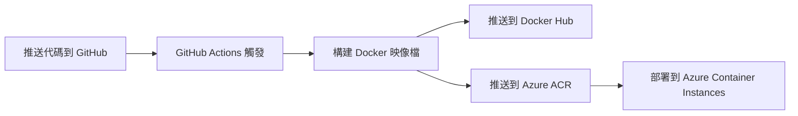

# 🚀 CI/CD 自動部署設置指南

本專案已配置 GitHub Actions 自動部署，支援：
- ✅ **Docker Hub** - 自動構建並推送映像檔
- ✅ **Azure** - 自動部署到 Azure Container Instances（可選）

---

## 📋 目錄

1. [快速開始](#快速開始)
2. [Docker Hub 設置](#docker-hub-設置)
3. [Azure 自動部署設置](#azure-自動部署設置可選)
4. [工作流程說明](#工作流程說明)
5. [手動觸發部署](#手動觸發部署)
6. [疑難排解](#疑難排解)

---

## 快速開始

### 自動部署觸發條件

當您推送代碼到以下分支時，會自動觸發部署：
- `main` 分支
- `claude/migrate-azure-docs-*` 分支

```bash
# 推送代碼即可觸發自動部署
git push origin main
```

---

## Docker Hub 設置

### 步驟 1：創建 Docker Hub 帳號

1. 前往 [Docker Hub](https://hub.docker.com/)
2. 註冊或登入（可使用 GitHub 帳號）

### 步驟 2：創建 Access Token

1. 登入 Docker Hub
2. 點選右上角頭像 → **Account Settings**
3. 選擇 **Security** → **New Access Token**
4. 填寫：
   ```
   描述: GitHub Actions
   權限: Read, Write, Delete
   ```
5. 點選 **Generate**
6. **⚠️ 複製 Token 並保存**（只會顯示一次）

### 步驟 3：在 GitHub 設置 Secrets

1. 前往您的 GitHub 倉庫
2. 點選 **Settings** → **Secrets and variables** → **Actions**
3. 點選 **New repository secret**
4. 添加以下兩個 secrets：

#### Secret 1: DOCKERHUB_USERNAME
```
Name: DOCKERHUB_USERNAME
Secret: 您的 Docker Hub 用戶名
```

#### Secret 2: DOCKERHUB_TOKEN
```
Name: DOCKERHUB_TOKEN
Secret: 剛才複製的 Access Token
```

### 步驟 4：測試 Docker Hub 自動部署

```bash
# 推送代碼
git add .
git commit -m "測試自動部署"
git push origin main

# 前往 GitHub → Actions 查看構建狀態
# 成功後，您的映像檔會出現在 Docker Hub
```

### 使用 Docker Hub 映像檔

部署成功後，可以這樣使用：

```bash
# 拉取最新映像檔
docker pull 您的用戶名/teacher-roster-backend:latest

# 運行容器
docker run -d \
  -p 3001:3001 \
  --env-file .env \
  -v $(pwd)/backend/azure-mysql-ca.pem:/app/azure-mysql-ca.pem:ro \
  --name teacher-roster-backend \
  您的用戶名/teacher-roster-backend:latest
```

---

## Azure 自動部署設置（可選）

如果您想要自動部署到 Azure Container Instances，需要進行以下設置：

### 前置準備

1. Azure 帳號
2. Azure Container Registry（ACR）
3. Azure Resource Group
4. Azure Database for MySQL

### 步驟 1：創建 Azure Container Registry

```bash
# 登入 Azure
az login

# 創建 Container Registry
az acr create \
  --resource-group teacher-roster-rg \
  --name teacherrostersacr \
  --sku Basic

# 啟用管理員帳號
az acr update \
  --name teacherrostersacr \
  --admin-enabled true

# 獲取登入憑證
az acr credential show --name teacherrostersacr
```

### 步驟 2：創建 Azure Service Principal

```bash
# 創建 Service Principal 並分配權限
az ad sp create-for-rbac \
  --name "github-actions-teacher-roster" \
  --role contributor \
  --scopes /subscriptions/YOUR_SUBSCRIPTION_ID/resourceGroups/teacher-roster-rg \
  --sdk-auth

# 複製輸出的 JSON（下一步會用到）
```

### 步驟 3：在 GitHub 設置 Azure Secrets

在 GitHub 倉庫的 **Settings** → **Secrets and variables** → **Actions** 添加以下 secrets：

#### 基本配置

| Secret Name | 說明 | 如何獲取 |
|------------|------|---------|
| `AZURE_CREDENTIALS` | Azure 登入憑證 | 步驟 2 的 JSON 輸出 |
| `AZURE_REGISTRY_NAME` | ACR 名稱 | 例如：`teacherrostersacr` |
| `AZURE_REGISTRY_USERNAME` | ACR 用戶名 | `az acr credential show` 的 username |
| `AZURE_REGISTRY_PASSWORD` | ACR 密碼 | `az acr credential show` 的 password |
| `AZURE_RESOURCE_GROUP` | 資源群組名稱 | 例如：`teacher-roster-rg` |

#### 資料庫配置

| Secret Name | 說明 | 範例 |
|------------|------|------|
| `DB_HOST` | Azure MySQL 主機 | `teacher-roster-mysql.mysql.database.azure.com` |
| `DB_PORT` | 資料庫端口 | `3306` |
| `DB_NAME` | 資料庫名稱 | `teacher_roster` |
| `DB_USER` | 資料庫用戶 | `roster_admin` |
| `DB_PASSWORD` | 資料庫密碼 | 您的密碼 |

#### 安全配置

| Secret Name | 說明 | 如何生成 |
|------------|------|---------|
| `JWT_SECRET` | JWT 密鑰 | `node -e "console.log(require('crypto').randomBytes(64).toString('hex'))"` |
| `SESSION_SECRET` | Session 密鑰 | `node -e "console.log(require('crypto').randomBytes(64).toString('hex'))"` |

### 步驟 4：測試 Azure 自動部署

```bash
# 推送代碼
git push origin main

# 前往 GitHub → Actions 查看部署狀態
# 成功後，應用會自動部署到 Azure Container Instances
```

### 訪問已部署的應用

部署成功後，在 GitHub Actions 日誌中會顯示應用 URL：

```
🌐 應用 URL: http://teacher-roster-xxx.eastasia.azurecontainer.io:3001
💚 健康檢查: http://teacher-roster-xxx.eastasia.azurecontainer.io:3001/health
```

---

## 工作流程說明

### 自動觸發流程



### Job 說明

#### Job 1: build-and-push-dockerhub
- **功能**: 構建並推送到 Docker Hub
- **觸發**: 每次推送都會執行
- **輸出**: Docker Hub 上的映像檔

#### Job 2: build-and-deploy-azure
- **功能**: 構建並部署到 Azure
- **觸發**: 只有在設置了 Azure secrets 時才執行
- **輸出**: 運行中的 Azure 容器

#### Job 3: notify
- **功能**: 顯示部署摘要
- **觸發**: 所有 job 完成後
- **輸出**: GitHub Actions 摘要

### 映像檔標籤策略

自動生成的標籤：
- `latest` - 最新的 main 分支構建
- `main` - main 分支的最新版本
- `claude/migrate-azure-docs-xxx` - 特定分支
- `main-abc1234` - 帶 commit SHA 的版本

---

## 手動觸發部署

### 方法 1：通過 GitHub 界面

1. 前往倉庫的 **Actions** 標籤
2. 選擇 **🚀 構建並部署到 Docker Hub + Azure**
3. 點選 **Run workflow**
4. 選擇分支並點選 **Run workflow**

### 方法 2：通過 Git Tag

```bash
# 創建標籤觸發部署
git tag -a v1.0.0 -m "Release version 1.0.0"
git push origin v1.0.0
```

---

## 疑難排解

### 問題 1: Docker Hub 推送失敗

**錯誤訊息**: `unauthorized: authentication required`

**解決方案**:
1. 檢查 `DOCKERHUB_USERNAME` 是否正確
2. 重新生成 `DOCKERHUB_TOKEN`
3. 確認 Token 有 Write 權限

### 問題 2: Azure 部署失敗

**錯誤訊息**: `The client 'xxx' with object id 'xxx' does not have authorization`

**解決方案**:
```bash
# 重新創建 Service Principal
az ad sp create-for-rbac \
  --name "github-actions-teacher-roster" \
  --role contributor \
  --scopes /subscriptions/YOUR_SUBSCRIPTION_ID/resourceGroups/teacher-roster-rg \
  --sdk-auth

# 更新 AZURE_CREDENTIALS secret
```

### 問題 3: 容器啟動失敗

**解決方案**:
```bash
# 查看容器日誌
az container logs \
  --resource-group teacher-roster-rg \
  --name teacher-roster-backend

# 檢查環境變數是否正確
az container show \
  --resource-group teacher-roster-rg \
  --name teacher-roster-backend \
  --query containers[0].environmentVariables
```

### 問題 4: 資料庫連線失敗

**解決方案**:
1. 檢查 Azure MySQL 防火牆規則
2. 添加 Azure 服務白名單：

```bash
az mysql flexible-server firewall-rule create \
  --resource-group teacher-roster-rg \
  --name teacher-roster-mysql \
  --rule-name AllowAzureServices \
  --start-ip-address 0.0.0.0 \
  --end-ip-address 0.0.0.0
```

---

## 查看部署狀態

### GitHub Actions 界面

1. 前往倉庫的 **Actions** 標籤
2. 查看最近的工作流程運行
3. 點選查看詳細日誌

### 檢查 Docker Hub

1. 登入 [Docker Hub](https://hub.docker.com/)
2. 前往您的倉庫
3. 查看 **Tags** 確認映像檔已推送

### 檢查 Azure 部署

```bash
# 查看容器狀態
az container show \
  --resource-group teacher-roster-rg \
  --name teacher-roster-backend \
  --query "{FQDN:ipAddress.fqdn,ProvisioningState:provisioningState}"

# 查看容器日誌
az container logs \
  --resource-group teacher-roster-rg \
  --name teacher-roster-backend \
  --follow
```

---

## 成本估算

### Docker Hub
- **免費方案**: 無限公開倉庫，1 個私有倉庫
- **費用**: $0/月

### Azure Container Instances
- **規格**: 1 vCPU, 1.5 GB 記憶體
- **費用**: 約 NT$200-400/月（按使用時間計費）

### Azure Container Registry
- **Basic 方案**: 10 GB 儲存空間
- **費用**: 約 NT$150/月

### 總計
- **僅 Docker Hub**: 免費
- **Docker Hub + Azure**: 約 NT$350-550/月

---

## 下一步

✅ **已完成**:
- GitHub Actions 自動構建
- Docker Hub 自動推送
- Azure 自動部署（可選）

📝 **建議後續步驟**:
1. 設置生產環境的環境變數
2. 配置自定義域名
3. 設置 HTTPS/SSL
4. 配置監控和警報
5. 設置自動擴展

---

## 相關文件

- [DEPLOYMENT_GUIDE.md](./DEPLOYMENT_GUIDE.md) - 手動部署指南
- [AZURE_SETUP.md](./AZURE_SETUP.md) - Azure 詳細設定
- [GitHub Actions 文件](https://docs.github.com/en/actions)
- [Docker Hub 文件](https://docs.docker.com/docker-hub/)
- [Azure Container Instances 文件](https://docs.microsoft.com/azure/container-instances/)

---

**需要協助？** 請參考疑難排解章節或查看 GitHub Actions 運行日誌。
